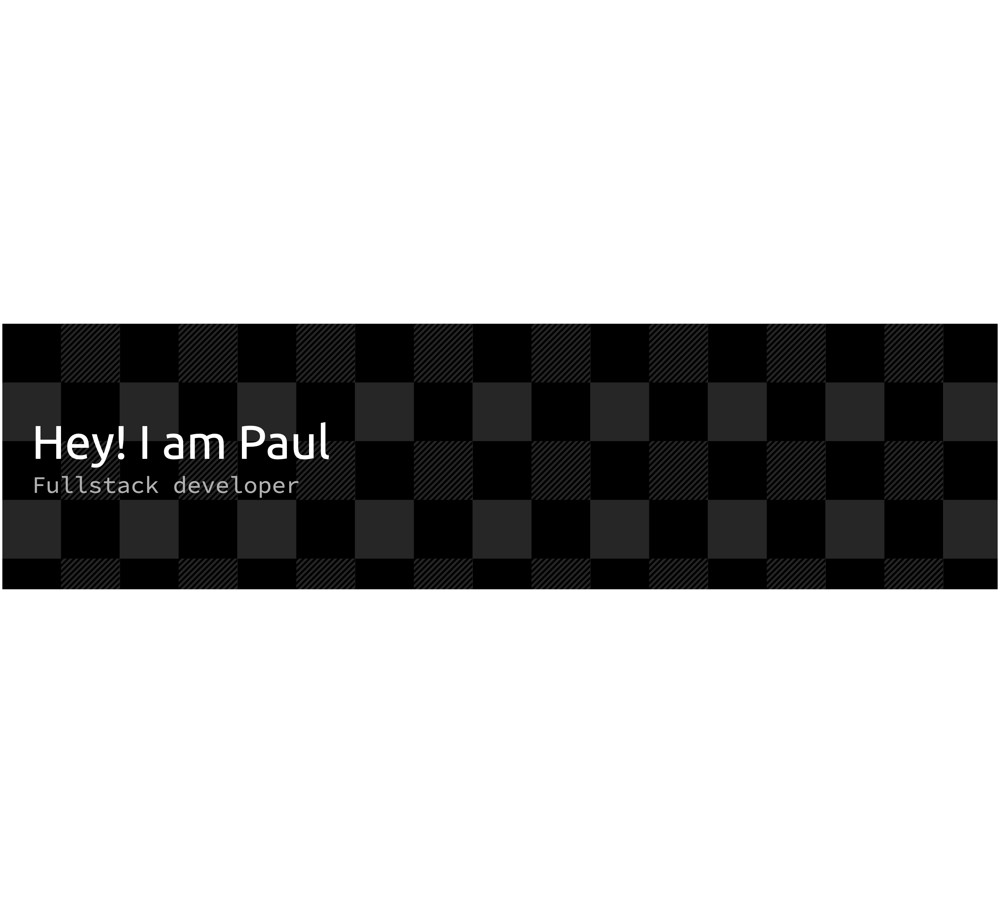

## Hi there 👋

<!--
**paul58914080/paul58914080** is a ✨ _special_ ✨ repository because its `README.md` (this file) appears on your GitHub profile.

Here are some ideas to get you started:

- 🔭 I’m currently working on ...
- 🌱 I’m currently learning ...
- 👯 I’m looking to collaborate on ...
- 🤔 I’m looking for help with ...
- 💬 Ask me about ...
- 📫 How to reach me: ...
- 😄 Pronouns: ...
- ⚡ Fun fact: ...
-->
## 👋 Hi, I'm Paul Williams — Principal Architect at Societe Generale

### 🚀 What I Do
I'm a Principal Architect with a passion for building robust, scalable solutions. My days are fueled by Java, Spring Boot, and Angular magic.

### 🛠 Top Skills & Technologies
- Java wizardry 🧙‍♂️
- Spring Boot specialist ☕
- Angular aficionado ⚡

### 🌟 Favorite Project
Check out [ff4j-spring-boot-java](https://github.com/ff4j/ff4j-spring-boot-java) — a personal favorite for feature flipping in Java microservices!

### 🔗 Find Me Online
- [paulwilliams.dev](https://paulwilliams.dev)

### 📜 Motto
> "If you can't explain it simply, you don't understand it well enough."

### 🎉 Fun Fact
I believe great architecture should make things easy for everyone — not just the experts!

---

